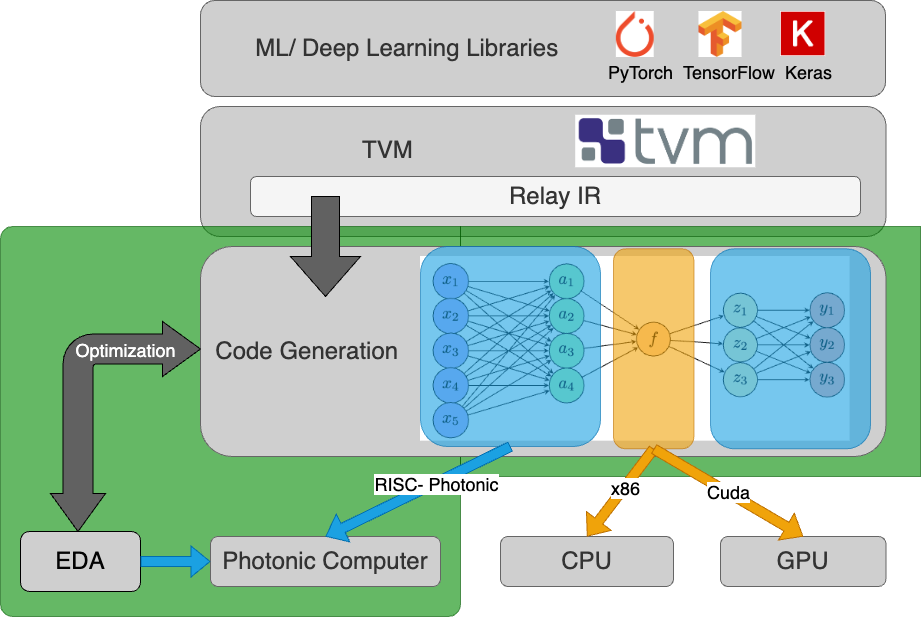

# Automated Compiler Software for Emerging Photonic Computing Hardware

*Contributions highlighted in green

## Overview
This project aims to make a compiler with optimization and code generation that can take neural network inference requests and divide the load between classical hardware (CPU/ GPU) and novel photonic hardware. We take advantage of the TVM compiler to translate Tensorflow and Pytorch models into their internal Relay IR, at which point this compiler conducts the next layer of scheduling and translation.

## File sections and definitions
- **inference_pratice:**
    recreating popular modles from scrach using numpy
    - submodule for GPT2 Debugging [huggingface_transformers](inference_pratice/huggingface_transformers)
    - LeNet
    -   numpy LeNet [lenet.ipynb](inference_pratice/lenet.ipynb)
    - GPT2
        - numpy GPT2 [np_gpt2.py](inference_pratice/np_gpt2.py)
        - numpy to Transformer model GPT2 comparison [gpt2_compairson.py](inference_pratice/gpt2_compairson.py)
        - Trace function calls of numpy GPT2 [model_trace.py](inference_pratice/model_trace.py)
        - Tensor product broken to dotproducts [opps.ipynb](inference_pratice/opps.ipynb)

- **json_parse:** IN PROGRESS.
Everything related to code generation and parsing of TVM Relay IR .json files
    - parser.py: script for instruction generation and file structure
    - simple_LeNet_parsed.txt: generated instructions

- **ONNX-ResNet:**
 model files/parameters for ResNet ML model in the ONNX format

- **Pytorch-LeNet:**
 model files/parameters and code for loading LeNet from pytorch

- **Transformer-GPT2**
    Compile GPT2 to Relay IR
    - Relay Graph.json tooling [GPT2_tooling.ipynb](Transformer-GPT2/GPT2_tooling.ipynb)
    - Compule GPT2 to Relay IR [transformer_GPT2.py](Transformer-GPT2/transformer_GPT2.py)

<!-- ## File sections and definitions
To recreate the Relay IR, run the followig for each model
- [LeNet_simple.py](Pytorch-LeNet/LeNet_simple.py)

To run optimization analysis and create RISC-Photonic instructions
- [parser.py](json_parser/parser.py) -->
